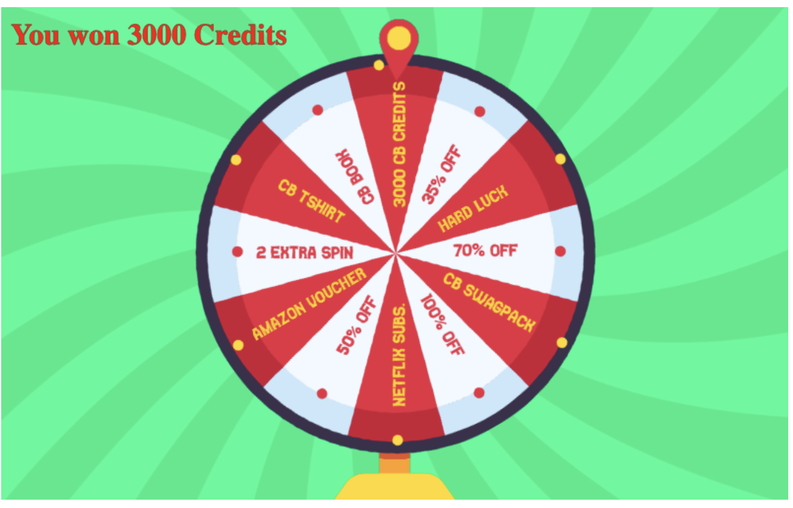
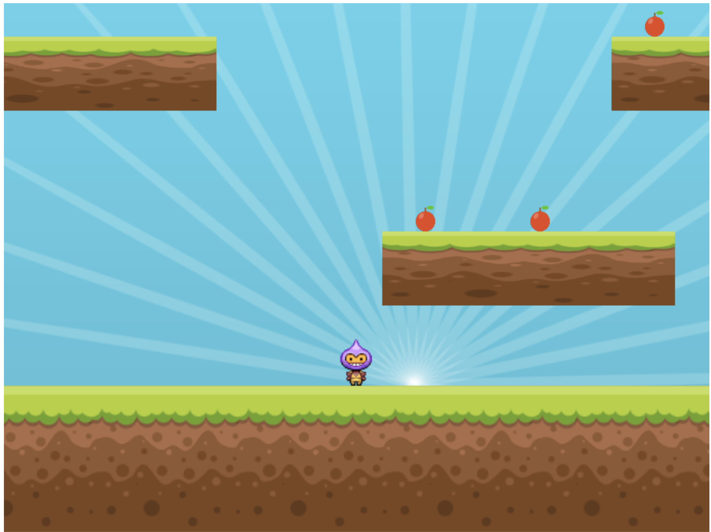
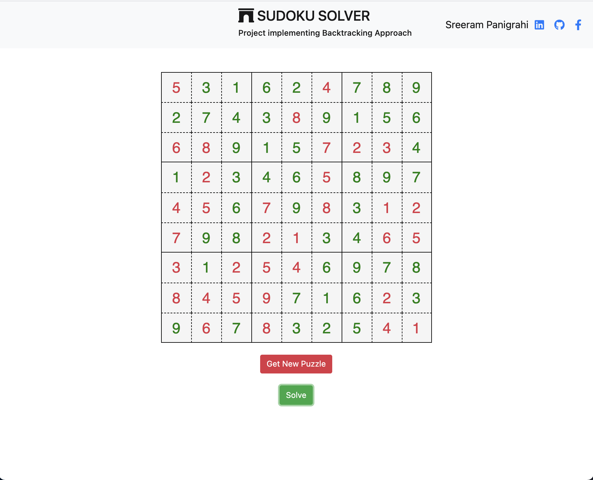
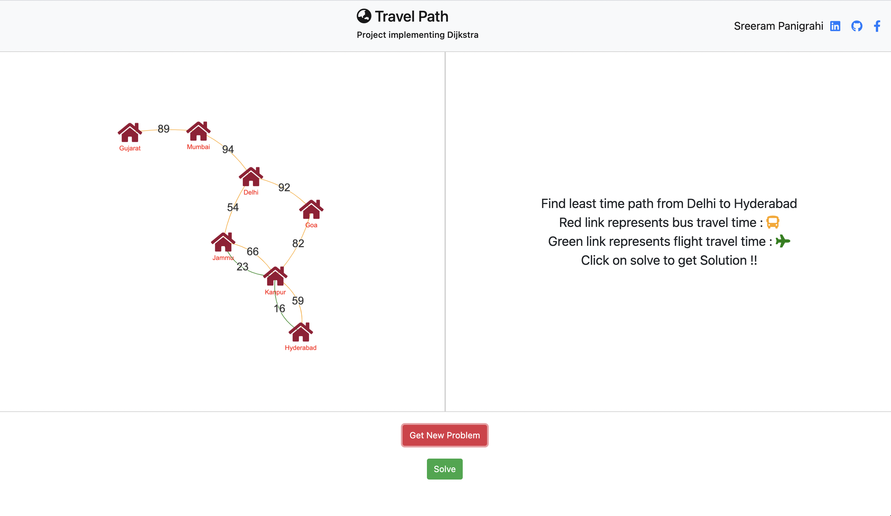
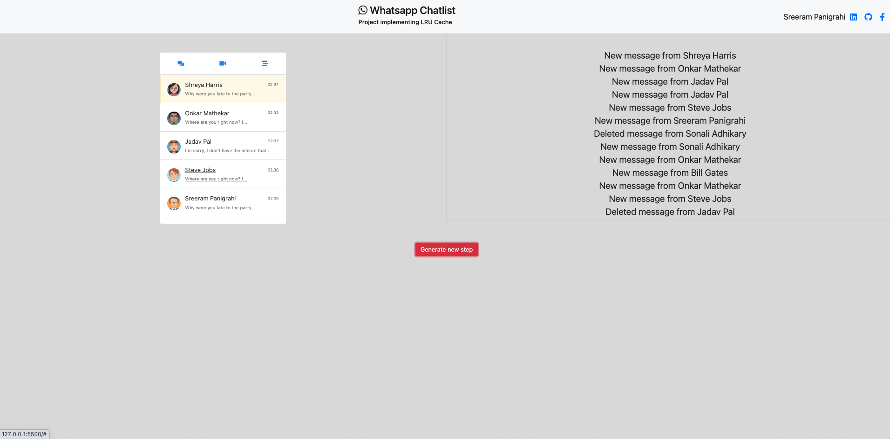
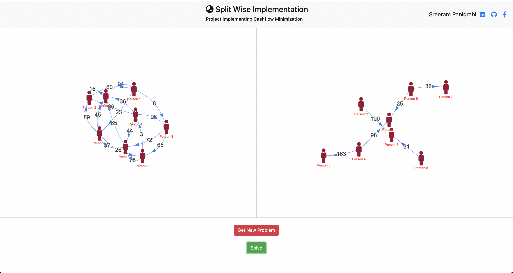
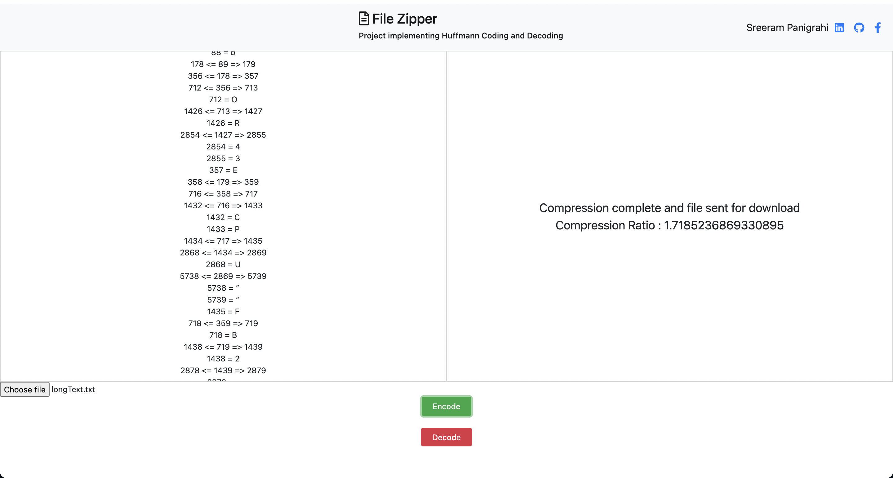

# DSA_Projects
Will be implementing Data structures and Algorithms in some real life projects in here. 

## Project 1 - Snake Game ##

This game is implementing Arrays , OOP principles and Game loop for creating the game. 

  

## Project 2 - Covid Fighter ##

This game is implementing Arrays , Gameloop and 2D collision algorithm in order to run the game and lead the player through bouncing obstacles through the arena.

  

## Project 3 - Spin N Win ##

This game is using the Phaser 3 framework that uses tweens for animations. Further we use basic maths and arrays to select the angles and select random prizes. This spin wheel is also implemented in many websites for offers and prizes section.

  

## Project 3 - Fruit Collector ##

This game is similar to Mario and uses Physics arcade engine of Phaser 3 framework. It uses tweens for animations and by using phaser framework, I have implemented overlaps and collisions on the various sprites in the game. 

  

## Project 4 - Sudoku Solver ##

I have implemented a sudoku solver that generates random sudoku problems from a heroku API and using that I fill the given Sudoku Boxes. Using the backtracking algorithm, I solve the sudoku for the given problem and fill it in the appropriate boxes.
The website uses Bootstrap 4 and FontAwesome for styling. 

  

## Project 5 - Travel Path
Implementing Dijkstra algorithm to find shortest distance between the source and the destination

  

## Project 6 - LRU CACHE - WHATSAPP CHATLIST
Created whatsappp chatlist with the concept from LRU cache where the messages are generated randomly and gets updated as per the various insertion and deletion instructions. It shows the latest messsages in the thread in the display.

  

## Project 7 - Splitwise Algorithm
Splitwise algorithm implementation to find the final amount that a user must receive/give to another user by overall simplying the debt/credit of all the person in the group.

  

## Project 8 - FILE Zipper for Text Files
File zipper for text files that encodes and stores the file on the browser using Huffman encoding algorithm and displays the compression ratio. It can also decode the encoded file back to their original form.

  

