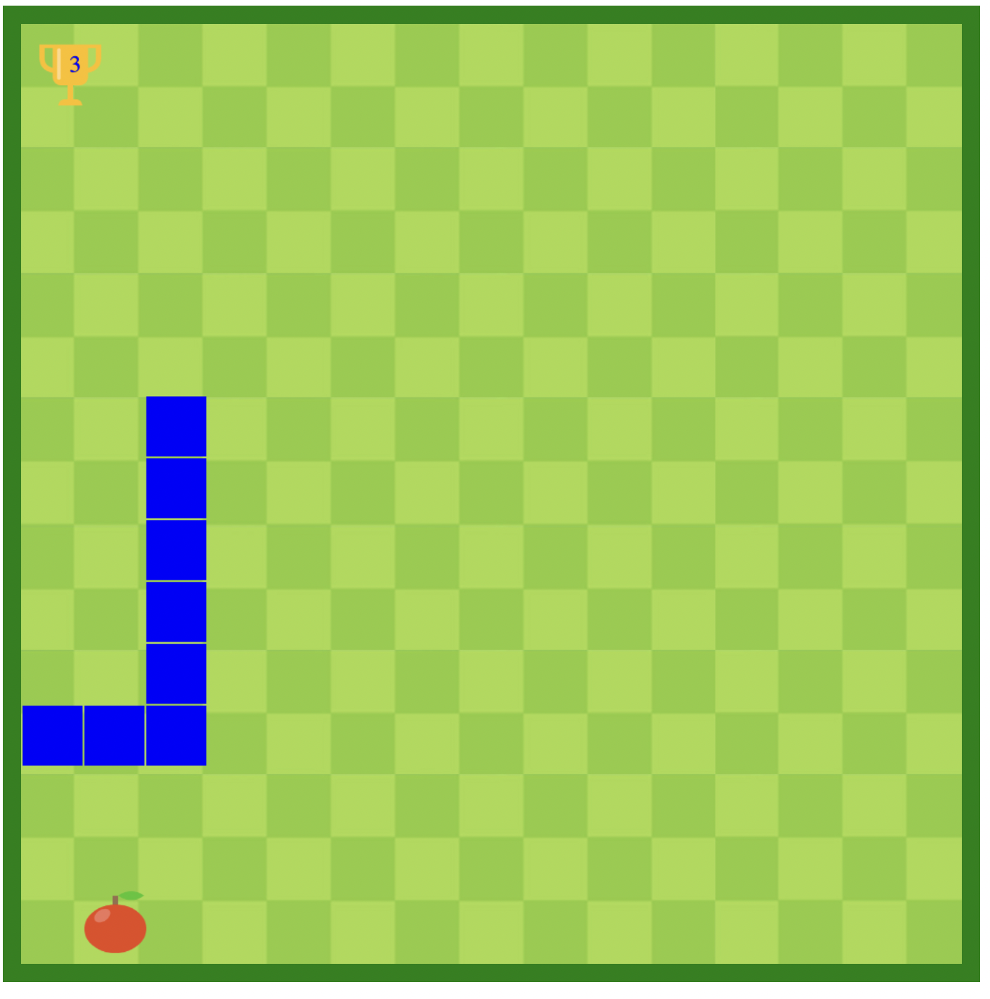
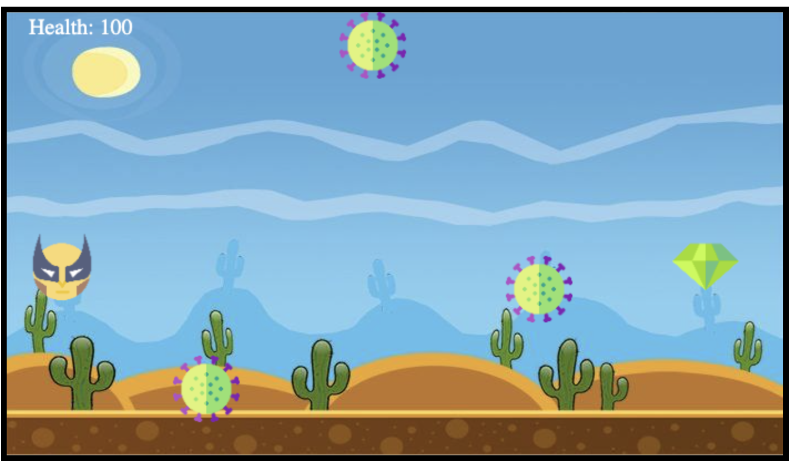

# DSA_Projects
Will be implementing Data structures and Algorithms in some real life projects in here. 

## Project 1 - Snake Game ##

This game is implementing Arrays , OOP principles and Game loop for creating the game. 

  

## Project 2 - Covid Fighter ##

This game is implementing Arrays , Gameloop and 2D collision algorithm in order to run the game and lead the player through bouncing obstacles through the arena.

  

